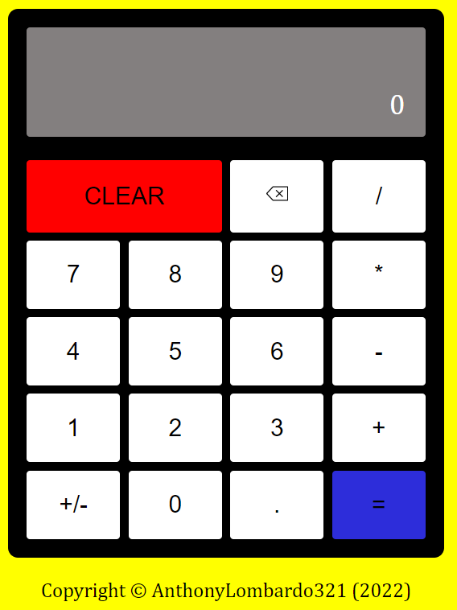

# Calculator
## Link: 

    

This project (from the Odin Project) was inspired by Windows Calculator.

## Features:
* Add
* Subtract
* Multiply
* Divide
* Delete a number
* Clear
* Negate a number
* Write numbers and decimals
* Make consecutive computations with the equal button

## What I learned:
* Adding Keyboard Support (by using event.key).
* Using Number() rather than using parseInt and parseFloat.
* Reinforcing what I learned so far in HTML, CSS (Grid and Flex), and JavaScript.
* How to be a better problem solver by breaking this project down into smaller tasks and finding better alternatives.